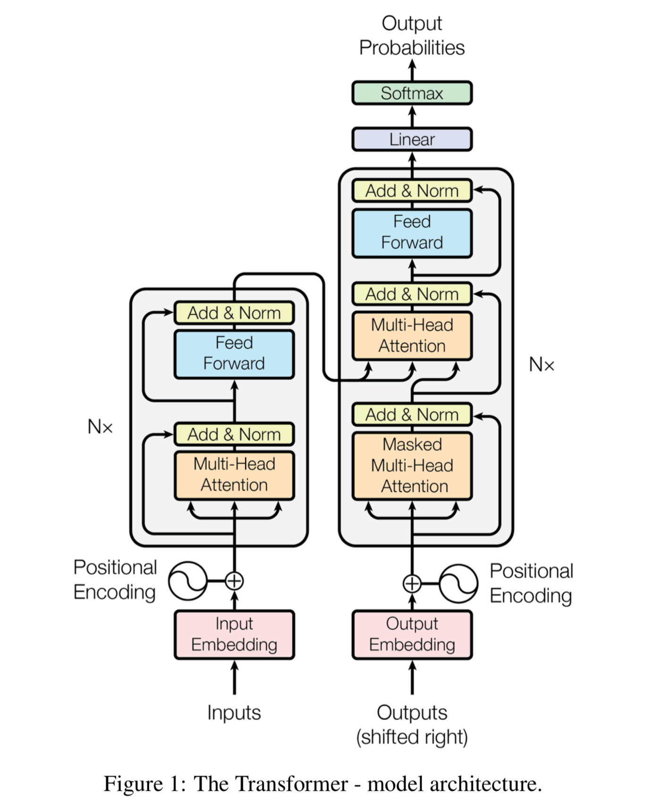

# Transformer from Scratch in PyTorch

This repository presents a comprehensive implementation of the Transformer architecture, as introduced in the paper ["Attention Is All You Need"](https://arxiv.org/abs/1706.03762), using Python and PyTorch. The project aims to provide a clear understanding of the inner workings of Transformers by building the model from the ground up.


##  Overview

The Transformer model revolutionized natural language processing by replacing recurrent and convolutional layers with self-attention mechanisms. This architecture enables efficient parallelization and has set new benchmarks in tasks like machine translation, language modeling, and sentiment analysis.


##  Project Objectives

* **Educational Insight**: Gain a deep understanding of the Transformer's components by building it from scratch.
* **Hands-on Experience**: Implement key features such as multi-head self-attention, positional encoding, and layer normalization.
* **Foundation for Innovation**: Serve as a base for experimenting with and extending Transformer models.


##  Architecture Breakdown

### 1. **Input Embedding**

Converts input tokens into continuous vector representations, capturing semantic information.

### 2. **Positional Encoding**

Since Transformers lack inherent sequential processing, positional encodings are added to input embeddings to retain token order information.

### 3. **Encoder**

Comprises multiple identical layers, each with:

* Multi-head self-attention mechanism
* Position-wise fully connected feed-forward networks
* Residual connections and layer normalization

### 4. **Decoder**

Also consists of multiple identical layers, each with:

* Masked multi-head self-attention
* Multi-head attention over encoder output
* Position-wise feed-forward networks
* Residual connections and layer normalization

### 5. **Output Layer**

A linear layer followed by a softmax function to generate probability distributions over the vocabulary.


##  Requirements

* Python 3.6+
* PyTorch
* NumPy
* Matplotlib

Install dependencies using:

```bash
pip install -r requirements.txt
```


##  Getting Started

1. **Clone the Repository**:

   ```bash
   git clone https://github.com/Shreya6901/Project1.git
   cd Project1
   ```


2. **Install Dependencies**:

   ```bash
   pip install -r requirements.txt
   ```


3. **Run the Model**:

   ```bash
   python main.py
   ```


*Note: Ensure you have a suitable dataset and adjust configurations as needed.*


##  References

* [Attention Is All You Need (Original Paper)](https://arxiv.org/abs/1706.03762)
* [The Illustrated Transformer](http://jalammar.github.io/illustrated-transformer/)
* [The Annotated Transformer](http://nlp.seas.harvard.edu/2018/04/03/attention.html)


For a visual understanding of the Transformer model, refer to the following illustration:




